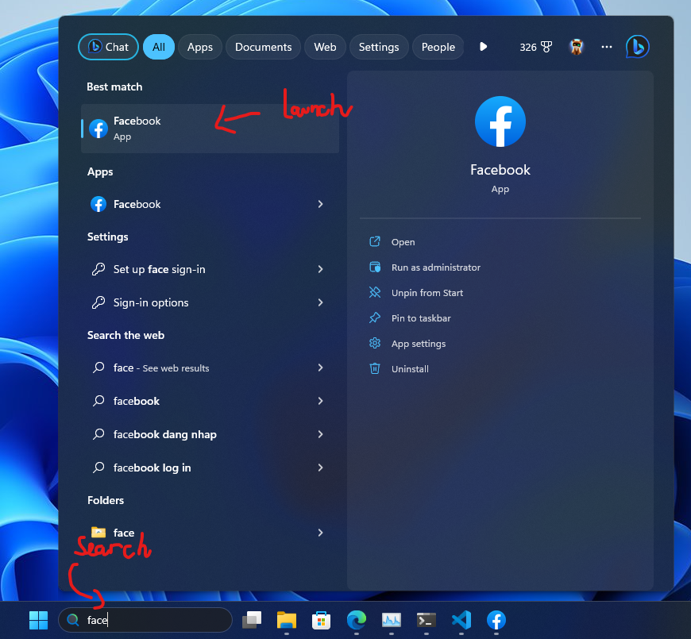

<!-- PROJECT LOGO -->
 

  

    
  CritiCat

  

  
  

    CritiCat is the purr-fect tool for anyone who wants to stay informed and avoid fake news on Facebook. With its powerful machine learning algorithms, CritiCat predicts the credibility of Facebook posts in real-time, allowing you to quickly determine which posts are trustworthy and which ones to avoid. Whether you're a concerned citizen looking to stay informed or a researcher looking for accurate data, CritiCat is the ideal companion for you. With CritiCat, you can effortlessly collect and rate Facebook posts with their credibility, helping you stay up-to-date and make informed decisions in real-time. So why wait? Download CritiCat now and start protecting yourself from fake news today!
  

# Hướng dẫn cài đặt

## Cài đặt CritiCat
1. Tải project:
    - Clone project bằng lệnh:

            git clone https://github.com/icyj1003/CritiCat

    - Hoặc có thể tải về từ trang Github theo hình dưới sau đó giải nén:

        .

2. Cài đặt tiện ích:
    - Đối với trình duyệt Edge: Truy cập đường dẫn "edge://extensions/"
    - Kích hoạt chế độ nhà phát triển
    - Ấn vào "Load unpacked" -> chọn folder "extension" vừa tải trong thư mục "CritiCat".

    .

## Cài đặt Web app cho Facebook
1. Truy cập m.facebook.com bằng trình duyệt của bạn theo đường dẫn sau: [Bấm zo đây nè](https://m.facebook.com/)
2. Đối với trình duyệt Edge: Bấm vào menu "3 dấu chấm" -> Apps -> Install Facebook (như hình dưới)

    .

3. Khởi động ứng dụng từ máy tính: Search -> Facebook. 
    .
4. Sau khi cài CritiCat và khởi động Facebook sẽ có giao diện như hình dưới.

    .

# Hướng dẫn gán nhãn
Bài viết được đánh giá là “reliable” khi đạt các tiêu chí sau:
- Bài viết từ nguồn tin đáng tin cậy (thông tin chính phủ, tin tức vtv, đại học quốc gia,..)
- Bài viết dựa trên các sự thật hiển nhiên (chiều nay mưa, )
- Không mang tính tính chất gây nhầm lẫn hoặc sai lệch thông tin.

Bài viết được đánh giá là “unreliable” nếu không đủ tiêu chí của một bài viết tin cậy. Ví dụ
- Bài viết từ các nguồn đáng tin cậy (các trang tin nhảm, tin tức chống phá, lừa đảo)
- Bài viết dựa trên quan điểm, ý kiến, niềm tin, nhận định của cá nhân mà không dựa trên nguồn tin tin cậy nào
- Bài viết có tính chất giật tít, câu tương tác hoặc thao túng dư luận.

